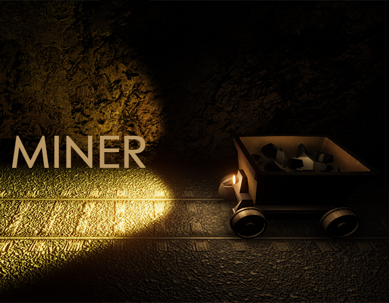
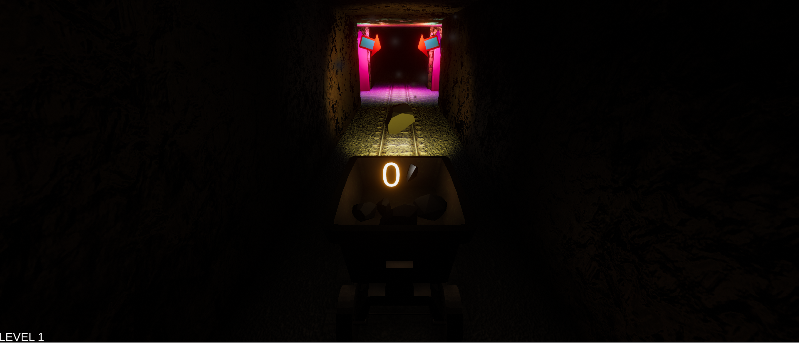

# Miner

Entry for Community Game Jam 2019 with the theme "The Game Is A Liar". The player controls a mine cart inside a mine area, which consists of a railroad network, and needs to collect as many coal pieces as possible while facing obstacles on the road. However, the game contains many lies and traps, as the theme requires - e.g. fake obstacles.

The game exploits the popular Unity game engine and C# for scripting. The art is mostly made by me in Blender, Photoshop and Bosca Ceoil.
